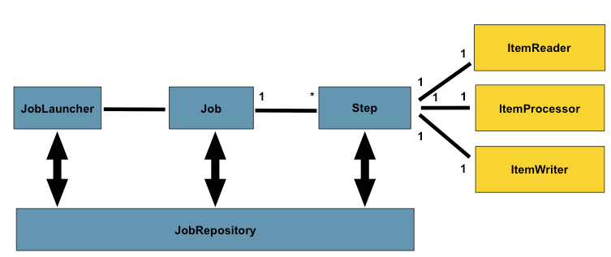
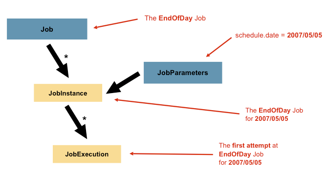
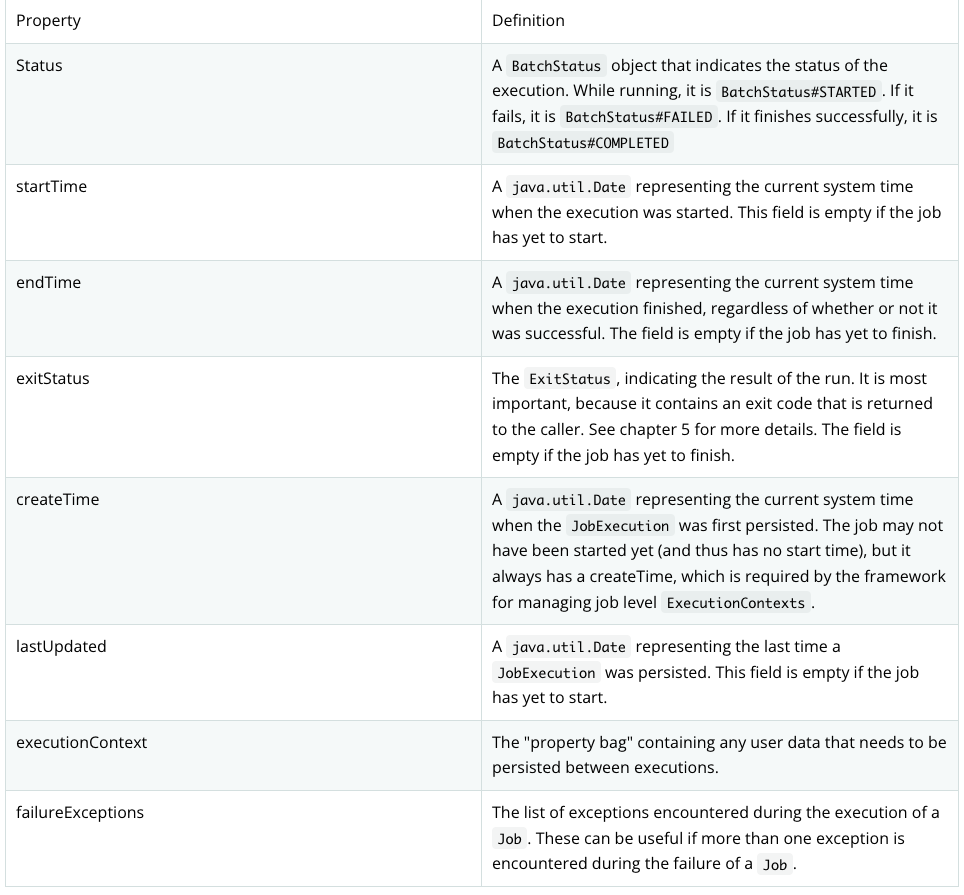
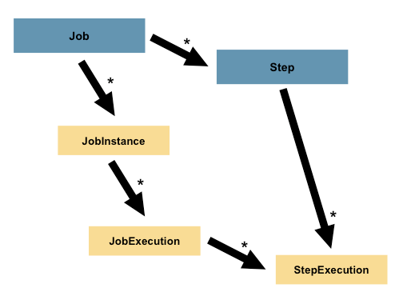
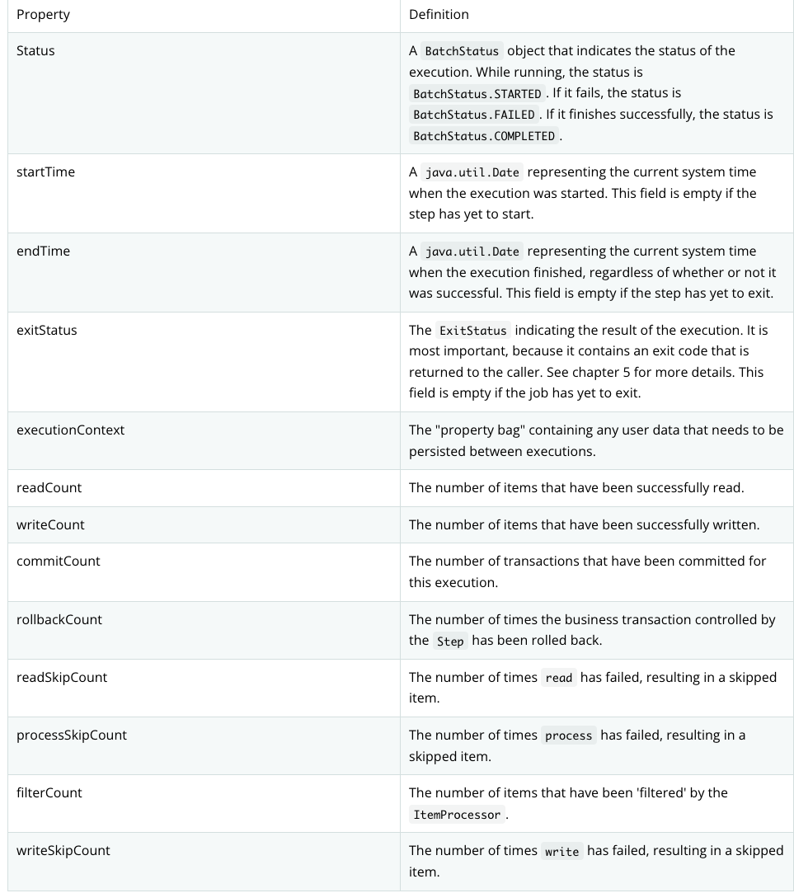

# Spring batch


- `Job`과 `Step`은 일대다 관계
- 각 `Step`에는 `ItemReader` 하나, `ItemProcessor` 하나, `ItemWriter` 하나로 구성
- `JobLauncher`로 `Job` 시작, `JobRepository`에 현재 실행중인 프로세스에 대한 메타데이터 저장

## Job
- 단순히 컨테이너
`Job`을 실행하는 다양한 방법과 실행 중 메타데이터가 저장되는 다양한 방법이 존재

### JobConfiguration
- `Job`의 이름
- `Step` 인스턴스의 정의 및 순서
- `Job` 재시작 여부

### JobInstance
- 논리적인 `Job` 실행 개념

### JobParameters
- `JobInstance`를 구분할 수 있는 데이터
- `JobInstance` = `Job` + `JobParameters`



### JobExecution
- `Job`을 실행하려는 단일 시도의 기술적 개념
- `JobExecution` properties



### Step
- `Job`은 하나 이상의 `Step`으로 구성
- `Step`에는 실제 일괄 처리를 정의하고 제어하는 데 필요한 모든 정보가 존재



### StepExecution
- `StepExecution`은 `Step`을 실행하려는 단일 시도
- `JobExecution`과 유사하게 실행될 때마다 새로 생성됨
- 실제로 `Step`이 시작될 때 생성됨



### ExecutionContext
- `Step`을 재시작 하기 위해 필요한 상태정보 등의 데이터가 포함되어 있음
- key-value 형태로 저장
- `JobExecution`당 하나가 존재하고 `StepExecution`당 하나가 존재, 그러나 둘은 다름

### JobRepository
- 메타 데이터와 배치 실행 계획 등이 저장되어 있음
- `JobLauncher`가 `JobExecution`을 생성하기 위해 이용
- 모니터링 영역에서도 사용됨 (어디까지 실행되었나, 처리되는데 걸리는 시간 등)

### `JobLauncher`
- 주어진 `JobParameters`로 `JOb`을 시작하기 위한 인터페이스
```java
public interface JobLauncher {
  public JobExecution run(Job job, JobParameters jobParameters) throws JobExecutionAlreadyRunningException, JobRestartException,
    JobInstanceAlreadyCompleteException, JobParametersInvalidException;
}
```

### ItemReader
- 하나의 `Step`은 0~1개의 `ItemReader`를 포함하며, 데이터를 조회하는 역할
- 제공할 수 있는 Item이 소진되면 null을 반환

### ItemProcessor
- 하나의 `Step`은 0~1개의 `ItemProcessor`를 포함하며, `ItemReader`를 통해 조회한 데이터를 중간에서 가공하는 역할

### ItemWriter 
- 하나의 `Step`은 0~1개의 `ItemWriter`를 포함하며, `ItemProcessor`를 통해 가공된 데이터를 `Write`하는 역할
- 이름이 `Writer` 지만, 쓰기만 가능한 건 아님!

### Chunk
- 하나의 `Transaction` 안에서 처리할 `Item`의 덩어리

### Tasklet
- `Step`에서 실행되는 작업

