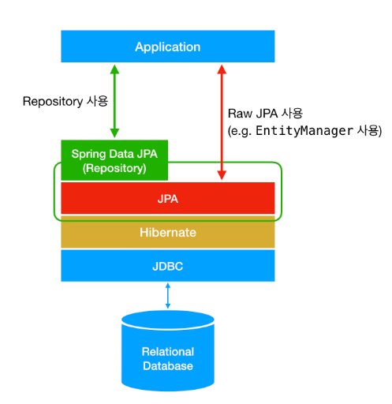

# JPA, Hibernate, Spring Data JPA의 차이점

## JPA
- Java Persistence API
- 자바 어플리케이션에서 관계형 데이터베이스를 사용하는 방식을 정의한 인터페이스
- 말 그대로 인터페이스다!! 특정 기능을 하는 라이브러리가 아니다. (RDB를 어떻게 사용해야 하는지를 정의한 방법일뿐)

`JPA`는 단순히 명세이기 때문에, JPA를 정의한 패키지 대부분은 `interface`, `enum`, `Exception`, 그리고 각종 `Annotation`으로 이루어져 있음
- 예를 들어, `JPA`의 핵심이 되는 `EntityManager`는 `javax.persistence.EntityManager`라는 파일에 interface로 정의되어 있음

## Hibernate는 JPA의 구현체이다.
- `javax.persistence.EntityManager`와 같은 인터페이스를 직접 구현한 라이브러리

## Spring Data JPA는 JPA를 쓰기 편하게 만들어 놓은 모듈이다.
- `Spring Data JPA`의 핵심은 `Repository`
- `Repository` 인터페이스에 정해진 규칙대로 메서드를 입력하면 알아서 해당 메서드 이름에 적합한 쿼리를 날리는 구현체를 만들어 `Bean`으로 등록해줌

## 혼동하지 말자!

